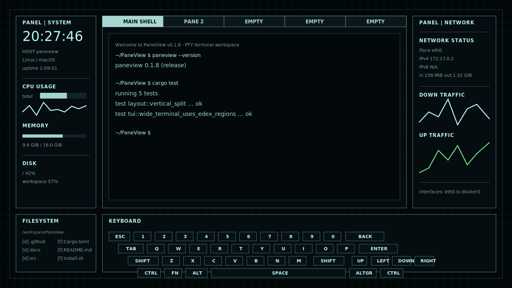

# PaneView

[](https://github.com/HoshiyomiLusia/paneview/actions/workflows/ci.yml)

A terminal UI for split PTY shell panes with a live system/network dashboard, on macOS and Linux.



- Real shell panes backed by PTYs, with vertical/horizontal splits.
- ANSI colours, attributes, and cursor rendered inside each pane.
- Live CPU, memory, disk, network, interface, host, kernel, and uptime views.
- Release installer plus `check-update` / `update` commands.

## Install

```bash
curl -fsSL https://raw.githubusercontent.com/HoshiyomiLusia/paneview/main/install.sh | sh
```

The installer downloads the matching prebuilt binary and installs `paneview`
into the first writable location it finds. It only needs `curl` and `tar`
(present on a normal macOS or Linux install). Windows is not supported.

Options:

```bash
# Install to a custom directory
PANEVIEW_INSTALL_DIR="$HOME/bin" sh -c 'curl -fsSL https://raw.githubusercontent.com/HoshiyomiLusia/paneview/main/install.sh | sh'

# Install a specific release
PANEVIEW_VERSION="v0.2.0" sh -c 'curl -fsSL https://raw.githubusercontent.com/HoshiyomiLusia/paneview/main/install.sh | sh'
```

Supported targets: `aarch64`/`x86_64` for `apple-darwin` and `unknown-linux-gnu`.

### Build from source

Needs Rust 1.95+.

```bash
cargo build --release   # binary at target/release/paneview
```

## Usage

```bash
paneview                # run the TUI
paneview --version
paneview check-update
paneview update
```

### Keybindings

PaneView uses a **`Ctrl+B` prefix** (like tmux), so `Ctrl+C/S/Q/W` and other
shell shortcuts reach the focused shell unchanged. Press the prefix, release,
then the command key.

| Chord | Action |
| --- | --- |
| `Ctrl+B  q` | Quit |
| `Ctrl+B  h / j / k / l` *(or arrows)* | Move pane focus |
| `Ctrl+B  \|` *(or `\`)* | Split vertically |
| `Ctrl+B  -` | Split horizontally |
| `Ctrl+B  n` *(or `c`)* | New pane |
| `Ctrl+B  x` *(or `w`)* | Close pane |
| `Ctrl+B  s` | Toggle the system dashboard |
| `Ctrl+B  [` *(or `PageUp`)* | Enter scroll mode |

In scroll mode: `PageUp/PageDown` (`b`/`f`) scroll a screen, `↑`/`↓` (`k`/`j`)
a line, `g`/`G` jump to top/bottom, `q`/`Esc` exit. The status bar shows
`PREFIX` / `SCROLL`, and a scrolled pane's border turns yellow.

Each pane runs your default shell. F1–F12, `Ctrl/Alt/Shift+arrows`, and
bracketed paste are forwarded. Unavailable metrics show as `N/A`. PaneView is
not a tmux replacement.

## License

MIT ([LICENSE-MIT](LICENSE-MIT)) or Apache-2.0 ([LICENSE-APACHE](LICENSE-APACHE)), at your option.
</content>
