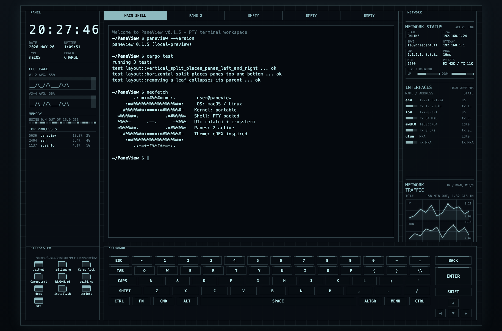

# PaneView

## Project Overview

PaneView is a Rust terminal UI for PTY-backed split shell panes and local system monitoring on macOS and Linux.

It provides:

- Multiple interactive shell panes backed by real PTYs.
- Vertical and horizontal splits.
- A system dashboard for CPU, memory, disk, network, interfaces, host, kernel, and uptime.
- Release-based install, update, and version commands.

### Example



## Environment Dependencies

Recommended binary installation requires:

- macOS or Linux.
- `curl`.
- `tar`.
- A UTF-8 capable terminal.
- A local Unix shell such as `zsh`, `bash`, or `sh`.

Rust, Cargo, and Git are only needed for source builds.

### macOS

Check:

```bash
uname -s
uname -m
command -v curl
command -v tar
```

Install missing command line tools:

```bash
xcode-select --install
```

### Linux

Check:

```bash
uname -s
uname -m
command -v curl
command -v tar
```

Install missing tools with your package manager. Debian or Ubuntu:

```bash
sudo apt update
sudo apt install -y curl tar
```

### Windows

Windows is not a supported target. Use macOS, Linux, or a Linux environment.

## Project Installation

Install the latest prebuilt release:

```bash
curl -fsSL https://raw.githubusercontent.com/HoshiyomiLusia/paneview/main/install.sh | sh
```

Install to a custom directory:

```bash
PANEVIEW_INSTALL_DIR="$HOME/bin" sh -c 'curl -fsSL https://raw.githubusercontent.com/HoshiyomiLusia/paneview/main/install.sh | sh'
```

Install a specific release:

```bash
PANEVIEW_VERSION="v0.1.5" sh -c 'curl -fsSL https://raw.githubusercontent.com/HoshiyomiLusia/paneview/main/install.sh | sh'
```

Optional source install:

```bash
cargo install --git https://github.com/HoshiyomiLusia/paneview.git --locked
```

## Usage

Run:

```bash
paneview
```

Version, update check, and update:

```bash
paneview --version
paneview check-update
paneview update
```

Keybindings:

| Key | Action |
| --- | --- |
| `Ctrl+Q` | Quit |
| `Ctrl+H/J/K/L` | Move focus |
| `Ctrl+\` | Vertical split |
| `Ctrl+-` | Horizontal split |
| `Ctrl+N` | New pane |
| `Ctrl+W` | Close focused pane |
| `Ctrl+S` | Toggle system panel |
| `Ctrl+C` | Send interrupt to focused pane |

Notes:

- The installer uses prebuilt GitHub Release binaries.
- Supported release targets are Linux/macOS on `x86_64` and `aarch64`.
- Unavailable system metrics are shown as `N/A`.
- PaneView is an MVP, not a full tmux replacement.
